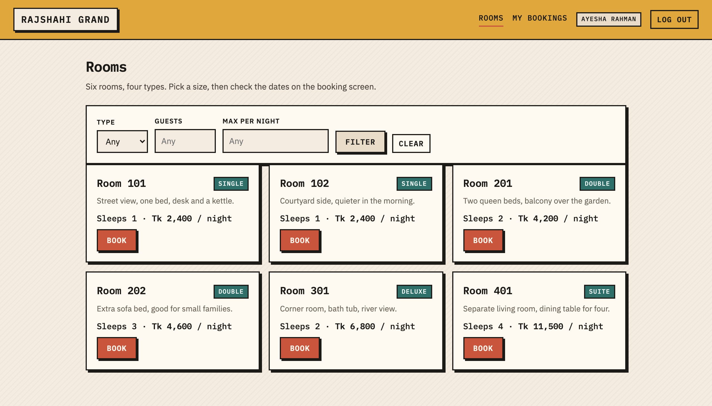
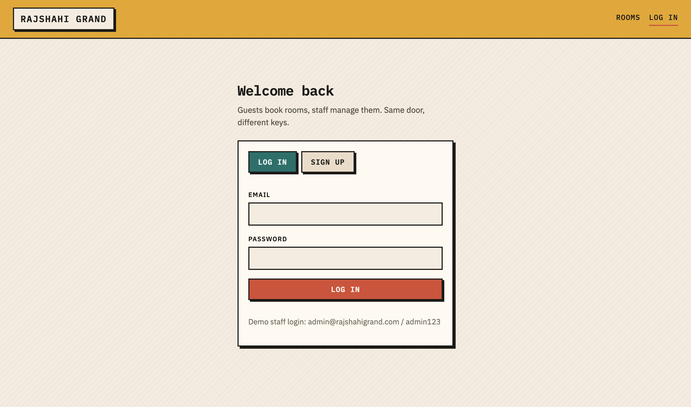
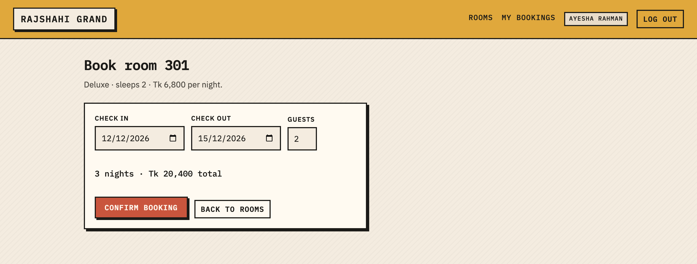
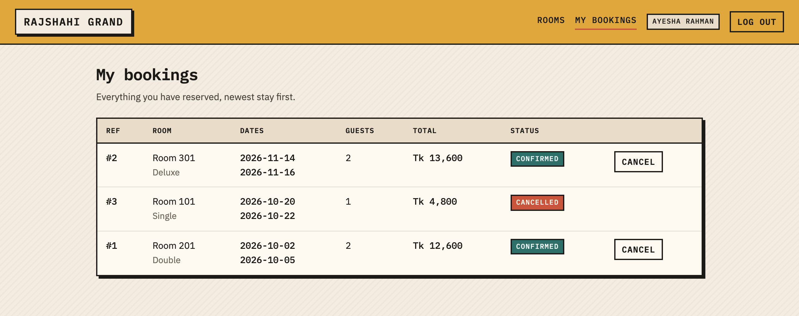
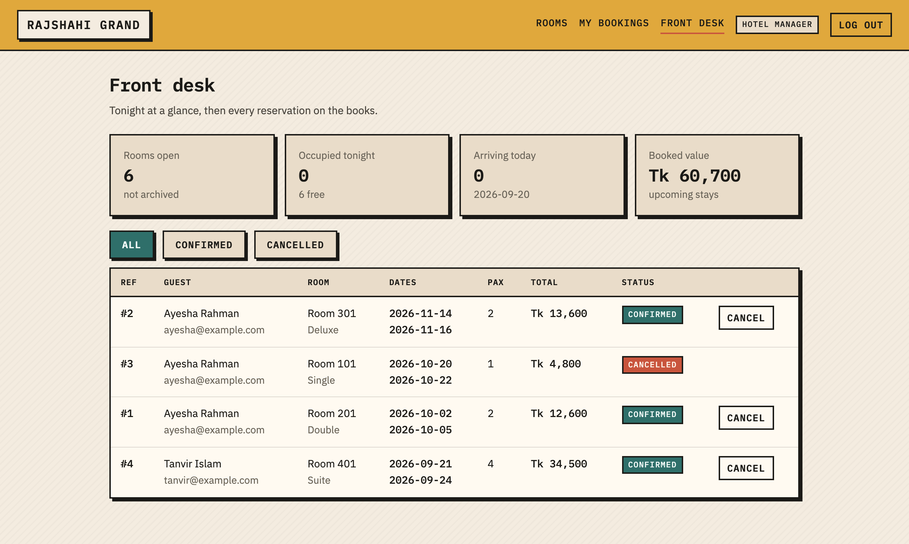

# Hotel Reservation System

CSE 3206 (Software Engineering Sessional) — Lab 2, Group #09, Section A, RUET.
Scenario 9: Hotel Reservation System. Process model: **Rapid Application Development (RAD)**.

A small reservation system for a single hotel. Guests sign up, browse rooms, book a date range and
cancel; front desk staff manage the room list and watch every reservation from a dashboard.



## Team and modules

| Member | GitHub | Module | Branches |
| --- | --- | --- | --- |
| Shirshen | [@shu-vro](https://github.com/shu-vro) | Platform core, authentication, UI shell, documentation | `feat/api-core-auth`, `docs/design-report` |
| Shahrirar Hasan | [@Shahrirar-Hasan](https://github.com/Shahrirar-Hasan) | Rooms module, front desk dashboard | `feat/rooms-module`, `feat/admin-dashboard` |
| Riyon Chowdhury | [@Riyon-Chowdhury](https://github.com/Riyon-Chowdhury) | Bookings module, availability rules | `feat/booking-module`, `fix/booking-date-validation` |

## Stack

- **Frontend** — Vite (vanilla JS), hash router, one stylesheet, no UI framework
- **Backend** — Express 5
- **Database** — SQLite through Node's built-in `node:sqlite`, so there is no driver to install
- **Tests** — `node:test`, covering the booking availability rules

## Running it

```bash
npm install
npm run dev
```

- UI: <http://localhost:5173>
- API: <http://localhost:3001> (Vite proxies `/api` to it, so there is no CORS setup)

The database file `data/hotel.db` is created and seeded on first boot with six rooms and a staff
account. Delete the file to start over.

| Login | Email | Password |
| --- | --- | --- |
| Staff | `admin@rajshahigrand.com` | `admin123` |
| Guest | sign up from the login screen | — |

Run the tests with:

```bash
npm test
```

## Project layout

```
index.html              app shell
src/
  main.js               hash router, layout, route guards
  api.js                fetch wrapper, session in localStorage
  styles.css            the whole stylesheet
  pages/                login.js  rooms.js  booking.js  bookings.js  admin.js
server/
  index.js              express wiring
  db.js                 opens the SQLite file, applies schema.sql
  schema.sql            users, rooms, bookings
  seed.js               staff account + sample rooms on an empty database
  auth.js               scrypt hashing, bearer tokens, requireAuth / requireAdmin
  availability.js       date rules and the clash query
  availability.test.js  node:test cases for those rules
  routes/               auth.js  rooms.js  bookings.js
docs/                   design report
screenshots/            UI and GitHub collaboration evidence
```

## API

| Method | Path | Who | What |
| --- | --- | --- | --- |
| POST | `/api/auth/register` | anyone | create a guest account, returns a token |
| POST | `/api/auth/login` | anyone | log in, returns a token |
| POST | `/api/auth/logout` | logged in | drop the token |
| GET | `/api/auth/me` | logged in | current user |
| GET | `/api/rooms` | anyone | list rooms, filters: `type`, `guests`, `max_price`, `include_archived` |
| GET | `/api/rooms/:id` | anyone | one room |
| POST | `/api/rooms` | staff | add a room |
| PATCH | `/api/rooms/:id` | staff | edit a room |
| DELETE | `/api/rooms/:id` | staff | archive a room (soft delete) |
| GET | `/api/bookings` | logged in | own bookings; staff get all, `?scope=mine` narrows it |
| POST | `/api/bookings` | logged in | book a room for a date range |
| POST | `/api/bookings/:id/cancel` | owner or staff | cancel a booking that has not started |

## Booking rules

- check-in cannot be in the past, and a stay is at least one night and at most thirty
- guests cannot exceed the room capacity
- two stays clash only when they share a night, so checking in on the morning another guest checks
  out is allowed
- cancelled bookings free the dates again
- a stay that has already started can no longer be cancelled from the app

## Screenshots

| | |
| --- | --- |
|  |  |
|  |  |

## Documentation

`docs/Requirement_Report.docx` — requirement analysis, RAD justification, comparison with other
process models, MVP design and the GitHub collaboration evidence for this milestone.
